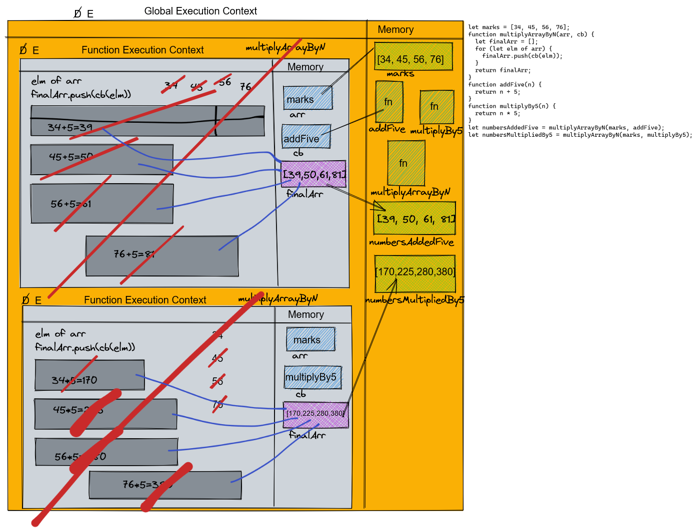

1. Which all function is Higher order function and which one is a callback function in the code given below.

```js
let marks = [34, 45, 56, 76]
function multiplyArrayByN(arr, cb) {
  // Higher order function
  let finalArr = []
  for (let elm of arr) {
    finalArr.push(cb(elm))
  }
  return finalArr
}
function addFive(n) {
  // Callback function
  return n + 5
}
function multiplyBy5(n) {
  // Callback function
  return n * 5
}
let numbersAddedFive = multiplyArrayByN(marks, addFive)
let numbersMultipliedBy5 = multiplyArrayByN(marks, multiplyBy5)
```

2. Create the execution context diagram of the above code snippet

```js



```

3. Write a higher order function that accepts a number and a operation function (callback function). Call the callback function passing the number as argument and return the returned value.

```js
function operation(n, opFn) {
  // your code goes her
  return opFn(n)
}
function divideBy5(n) {
  return n / 10
}
function multiplyAndHalf(n) {
  return (n * n) / 5
}
// TEST
console.log(operation(21, divideBy5))
// Output: 2.1
console.log(operation(10, multiplyAndHalf))
// Output: 20
// Output: 20
```

4. Write a higher order function that accepts a string and a operation function (callback function). Call the callback function passing the string as argument and return the returned value.

```js
function operation(str, opFn) {
  // your code goes her
  return opFn(str)
}
function upperCase(text) {
  return text.toUpperCase()
}
function splitText(text) {
  return text.split(' ')
}
// TEST
console.log(operation('Learning to fly', upperCase))
// Output: "LEARNING TO FLY"
console.log(operation('Higher Order Fucntion', splitText))
// Output: ["Higher","Order","Function"]
```
